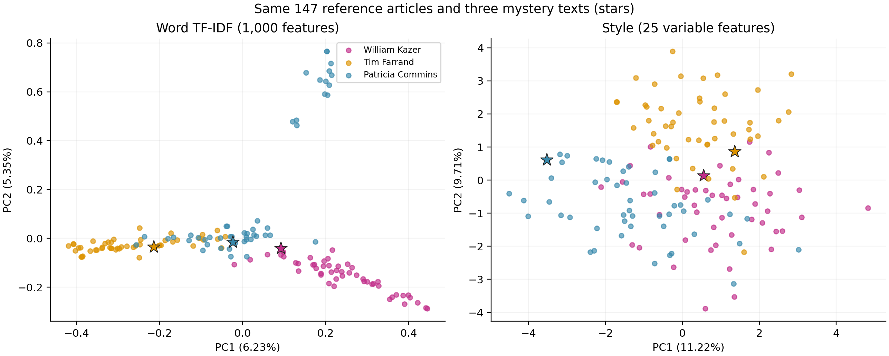

# Automatische Autorschaftserkennung journalistischer Texte mittels stylometrischer Merkmale und klassischer Machine-Learning-Verfahren

**Deutsch** | [English](README.md)

Kursprojekt von **Jonaid Aydi und Kai S. Kurono**, *Advanced Python for NLP* (2026), Rainer Osswald und Yulia Zinova.

Lassen sich Reuters-Artikel dreier Autoren anhand von Wortmerkmalen und expliziten Stilmerkmalen unterscheiden? Wir vergleichen den nächsten Nachbarn im TF-IDF-Raum mit dem nächsten Nachbarn und dem nächsten Autorenzentrum im Stilmerkmalsraum. PCA und hierarchisches Clustering dienen der Exploration. Die Klassifikation verwendet die vollständigen Merkmalsräume.

## Ergebnisse und Berichte

| Verfahren | Mystery korrekt | Offizieller Test korrekt | Test-Accuracy | Macro-F1 |
|---|---:|---:|---:|---:|
| TF-IDF, nächster Nachbar | 3/3 | 137/150 | 91,33 % | 0,9138 |
| Stil, nächster Nachbar | 1/3 | 104/150 | 69,33 % | 0,6864 |
| Stil, nächstes Autorenzentrum | 2/3 | 124/150 | 82,67 % | 0,8283 |

Der Test enthält 50 Artikel je Autor. Die konstante Vorhersage eines einzigen Autors erreicht 33,33 % Accuracy. Die Ergebnisse gelten für diese Autorenauswahl und belegen keine themenunabhängige Autorschaftserkennung.

- [Gemeinsamer Bericht](reports/joint_report.pdf), vorgesehen als zusammengeführter Abgabebericht.
- Einzelbeiträge: [Kai S. Kurono](reports/kai_report.pdf) und [Jonaid Aydi](reports/jonaid_report.pdf).
- [Deutsche Präsentation](presentation/ap_presentation_de.pptx) und [Sprechernotizen](presentation/speaker_notes_de.md).
- [Ergebnistabellen und dokumentbezogene Nachweise](results/README.md).
- [Prüfprotokoll und technische Einzelheiten](REPRODUCIBILITY.md).



## Installation und Ausführung

Geprüft unter **Windows mit Python 3.13.13** in einer neu angelegten virtuellen Umgebung. Die Befehle im Hauptordner des Repositorys ausführen. Installation und erste Datenvorbereitung benötigen Internetzugang.

```powershell
git clone https://github.com/jonaidaydi/authorship-stylometry.git
cd authorship-stylometry
python -m venv .venv
.venv\Scripts\python.exe -m pip install -r requirements.txt
.venv\Scripts\python.exe prepare_data.py --federalist
.venv\Scripts\python.exe run_analysis.py
```

Für `python -m venv` einen Python-3.13-Interpreter verwenden. Unter macOS/Linux `.venv/bin/python` statt `.venv\Scripts\python.exe` einsetzen. Diese Betriebssysteme wurden nicht geprüft.

`requirements.txt` legt die direkten Paketversionen fest und installiert `en_core_web_sm` 3.8.0 mit. `requirements-lock.txt` dokumentiert die vollständige getestete Windows-Umgebung. Das Modell stammt aus dem offiziellen spaCy-Release auf GitHub. Für den Snowball-Stemmer ist kein NLTK-Korpusdownload nötig.

`prepare_data.py` lädt das UCI-Archiv und entpackt nur die 300 verwendeten Artikel nach `reuter+50+50/`. `--federalist` bereitet zusätzlich `federalist.txt` vor. Bereits vorhandene Dateien mit abweichendem Inhalt werden nicht überschrieben. Ein vorhandenes Reuters-Archiv lässt sich so verwenden:

```powershell
.venv\Scripts\python.exe prepare_data.py --archive "Pfad/zur/reuter_50_50.zip"
```

`run_analysis.py` ist der Haupteinstieg. Das Programm schreibt den Methodenvergleich, alle Vorhersagen, Merkmale, Hashes, PCA-Koordinaten und die Vergleichsgrafik nach `results/`. Um die veröffentlichten Referenzergebnisse beim eigenen Lauf zu erhalten:

```powershell
.venv\Scripts\python.exe run_analysis.py --output-dir verification_outputs/reuters
```

Mit `--data-dir` lässt sich ein anderer Datenordner angeben. Darin müssen `C50train` und `C50test` liegen, jeweils mit den Unterordnern `WilliamKazer`, `TimFarrand` und `PatriciaCommins` und je 50 `.txt`-Dateien. Rohdaten, Zwischenspeicher und virtuelle Umgebungen werden von Git ignoriert.

## Versuchsaufbau

| Autor | Korpusordner | Referenz | Mystery | Offizieller Test |
|---|---|---:|---:|---:|
| William Kazer | `WilliamKazer` | 49 | 1 | 50 |
| Tim Farrand | `TimFarrand` | 49 | 1 | 50 |
| Patricia Commins | `PatriciaCommins` | 49 | 1 | 50 |
| Gesamt | | 147 | 3 | 150 |

Die alphabetisch erste Trainingsdatei je Autor ist der Mystery-Text. Die übrigen 49 Trainingsartikel bilden die Referenzmenge. Die Mystery-Texte werden für den offiziellen Test nicht wieder aufgenommen. Alle Verfahren verwenden dieselben Dokumente.

TF-IDF verwendet NLTK-Snowball-Stemming, Wort-N-Gramme der Längen 1–3, höchstens 1.000 Merkmale, `min_df=2`, `max_df=0.9` und englische Stoppwörter. Das angepasste Vokabular enthält 832 Unigramme, 151 Bigramme und 17 Trigramme. Die ursprüngliche Kombination aus Stemmer und Stoppwortliste erzeugt einen dokumentierten scikit-learn-Hinweis. Sie bleibt für die Vergleichbarkeit mit der Exploration erhalten.

Die 26 vorab festgelegten Stilmerkmale umfassen fünf Oberflächenmaße, die Häufigkeiten von 15 Funktionswörtern und sechs Satzzeichen. Als Wörter zählen alphabetische spaCy-Tokens. Ein konstantes Merkmal entfällt, sodass 25 Dimensionen bleiben. Die Implementierung behält die Rundungsregeln der Reportanalyse bei. POS-N-Gramme gehören nicht zu diesem Experiment.

Vokabular, IDF, Standardisierung, Konstantenfilter, Autorenzentren und PCA werden ausschließlich aus den Referenzartikeln bestimmt. NumPy berechnet euklidische Distanzen. Die PCA mit vollständiger SVD ist deterministisch und dient nur der Darstellung. Anhand der offiziellen Testergebnisse wurden keine Modellparameter oder Merkmalsgruppen ausgewählt.

## Code und Notebooks

| Datei | Aufgabe |
|---|---|
| `prepare_data.py` | Daten herunterladen und auswählen |
| `run_analysis.py` | Vollständiger Reuters-Vergleich mit Auswertung und Ausgaben |
| `stylometry/corpus.py` | Dokumentidentitäten, Aufteilung und Prüfung exakter Duplikate |
| `stylometry/features.py` | Gemeinsame Worttokenisierung und 26 Stilmaße |
| `stylometry/models.py` | Standardisierung anhand der Referenz und NumPy-Distanzen |
| `stylometry/federalist.py` | Gemeinsame Extraktion der Federalist-Textkörper und getrennte Labels |
| [Reuters-Notebook](reuter%20HKA%2C%20HCA.ipynb) | TF-IDF-Exploration, Ward-HCA im vollständigen Raum, PCA und drei Mystery-Zuordnungen |
| [Federalist-PCA](HKA%20Federalist%20Papiere.ipynb) | Ergänzendes Beispiel mit TF-IDF und PCA |
| [Federalist-HCA](HCA%20Federalist%20Papiere.ipynb) | Ergänzendes Beispiel mit Worthäufigkeiten und deaktivierter IDF |

Notebooks mit `.venv\Scripts\python.exe -m jupyterlab` öffnen und alle Zellen mit frischem Kernel der Reihe nach ausführen. Sie bleiben im Hauptordner des Repositorys. Ihre Ausgaben sind in Git geleert. Erzeugte Explorationsgrafiken bleiben lokal.

Die Federalist-Notebooks verwenden dieselben 85 bereinigten Aufsätze. Überschriften, Autorenangaben, Publikationsdaten, Anrede und PUBLIUS-Signatur samt nachfolgenden Endnoten sind ausgeschlossen. Die erste Fassung von Aufsatz 70 bleibt erhalten. Die Nummern stammen aus den Quellüberschriften. Aufsätze 49–58, 62 und 63 tragen das Label `Disputed`, 18–20 das Label `Joint`. Ward erhält kondensierte euklidische Distanzen. Die korrigierten Beispiele ersetzen die früheren unbereinigten Darstellungen und ergänzen Reuters.

## Prüfungen

```powershell
.venv\Scripts\python.exe -m pip check
.venv\Scripts\python.exe -m unittest discover -s tests -v
.venv\Scripts\python.exe verify_notebooks.py
```

Die Notebookprüfung verwendet diese Python-Umgebung, startet für jedes Notebook einen frischen Kernel und speichert ausgeführte Kopien im ignorierten Ordner `verification_outputs/`. Der Hauptlauf wurde mit der früheren lokalen Reportanalyse verglichen. Dokumentidentitäten, sämtliche Stilmerkmale, Vorhersagen und Modellkennzahlen stimmen überein.

## Interpretation und Grenzen

Themen, redaktionelle Vorgaben und verwandte Nachrichten können die Trefferquoten beeinflussen. Die Prüfung identischer Dateien und Texte kontrolliert weder ähnliche Meldungen noch Themen. Drei Mystery-Texte allein erlauben keine allgemeine Leistungsaussage. Standardisierung kann seltenen Satzzeichen großen Einfluss geben. Die Type-Token-Ratio hängt von der Textlänge ab. Die [drei dokumentierten Fehlerfälle](results/README.md) veranschaulichen diese Grenzen. Ihre Auswahl erfolgte nach der Auswertung und führte zu keiner Modelländerung.

## Beiträge und Hilfsmittel

| Mitwirkende | Projektverantwortung |
|---|---|
| Kai S. Kurono | Reuters- und Federalist-Exploration, Wortrepräsentationen, PCA, hierarchische Clusteranalyse und Reuters-Mystery-Zuordnung. |
| Jonaid Aydi | Ergänzender Stilmerkmalsvergleich, Auswertung des offiziellen Testsplits, Repositoryintegration, Reproduzierbarkeit und zweisprachige Dokumentation. |

Codex unterstützte die Codeintegration, Fehlerdiagnose, Prüfung sowie die Vorbereitung der Berichte und Präsentation. Das Repository dokumentiert die implementierten Methoden und reproduzierbaren Ergebnisse. Die beiden Mitwirkenden verantworten die eingereichte Arbeit und ihre Erklärung.

## Quellen

- Liu, Z. (2006). *Reuter_50_50*. UCI Machine Learning Repository. [DOI: 10.24432/C5DS42](https://doi.org/10.24432/C5DS42), die Datensatzseite nennt CC BY 4.0.
- Hamilton, Madison und Jay. *The Federalist Papers*. [Project Gutenberg eBook 18](https://www.gutenberg.org/ebooks/18).
- [NLTK Snowball](https://www.nltk.org/api/nltk.stem.snowball.html), [spaCy Linguistic Features](https://spacy.io/usage/linguistic-features), [scikit-learn TF-IDF](https://scikit-learn.org/stable/modules/generated/sklearn.feature_extraction.text.TfidfVectorizer.html), [SciPy linkage](https://docs.scipy.org/doc/scipy/reference/generated/scipy.cluster.hierarchy.linkage.html).
